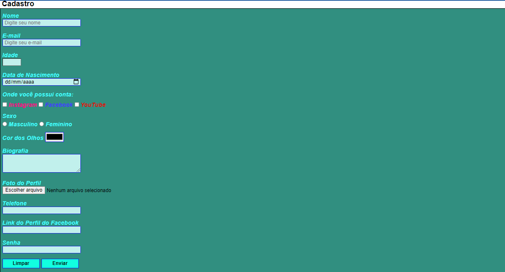

# FirstChallengeCSS
Desafio proposto pelo curso DevClub para criação do formulário de preenchimento desta vez utilizando HTML e CSS. 
Seguindo para o módulo de CSS, o primeiro desafio foi pegar o formulário que eu tinha feito em HTML e adicionar a estilização com CSS, dando vida ao site, proporcionando uma experiência gratificante, vendo todos os elementos tomando forma. Foram utilizados HTML e CSS.

> Resultado do projeto:

## 🛠 Ferramentas utilizadas:

## 💻 Tecnologias utilizadas:

## O que foi desenvolvido:

- [x] Formulário de cadastro
- [x] Estilização dos componentes utilizando CSS

## 👦🏼 Pessoas envolvidas no projeto:

<table>
  <tr>
    <td align="center">
      <a href="https://github.com/gGtEriKk">
         
          
            <b>Erik Gomes</b>
          
      </a>
</table>